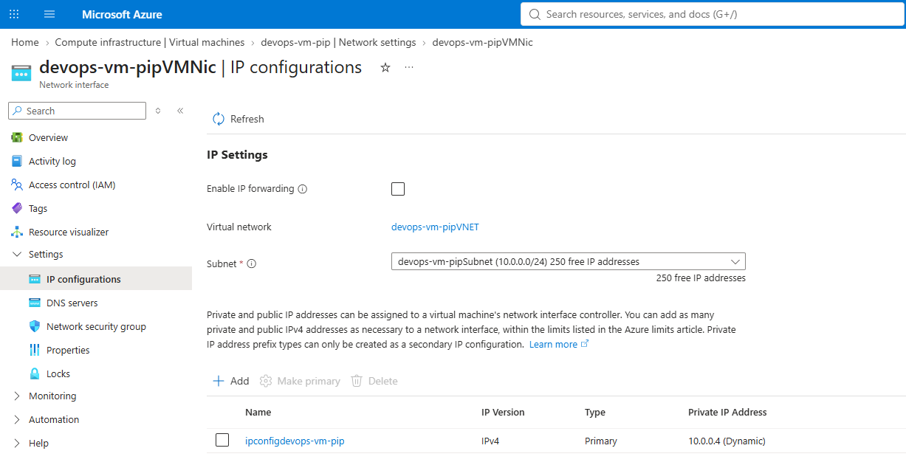
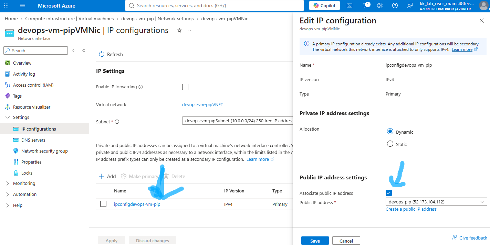

# Question

The Nautilus DevOps team has already set up a virtual machine and allocated a public IP address. The final task is to attach this public IP to the VM's network interface card (NIC).
An existing VM named `devops-vm-pip` and a public IP address named `devops-pip` already exist.
Attach the public IP `devops-pip` to the network interface of the VM `devops-vm-pip`.
Make sure the VM is properly assigned the public IP.

# Step by Step Solution

## Option 1: Using Azure CLI (Recommended)
First, find the name of the NIC attached to devops-vm-pip, then associate devops-pip to its primary IP configuration.

### 1. Get the NIC name associated with devops-vm-pip:
```bash
az vm show \
  --resource-group <YOUR_RESOURCE_GROUP> \
  --name devops-vm-pip \
  --query "networkProfile.networkInterfaces[0].id" \
  --output tsv
```
(Note down the NIC name from the end of the resource ID output, or store it in a variable).

### 2. Attach the Public IP to the NIC's IP configuration:
```bash
# Get the NIC name
NIC_NAME=$(az vm show --resource-group <YOUR_RESOURCE_GROUP> --name devops-vm-pip --query "networkProfile.networkInterfaces[0].id" -o tsv | awk -F'/' '{print $NF}')

# Update the IP configuration with the public IP
az network nic ip-config update \
  --resource-group <YOUR_RESOURCE_GROUP> \
  --nic-name $NIC_NAME \
  --name ipconfig1 \
  --public-ip-address devops-pip
```

### 3. Verify Assignment:
```bash
az network public-ip show \
  --resource-group <YOUR_RESOURCE_GROUP> \
  --name devops-pip \
  --query "{Name:name, IPAddress:ipAddress, AttachedTo:ipConfiguration.id}" \
  --output table
```

## Option 2: Using the Azure Portal

### 1. Navigate to the Virtual Machine:

Find the associated NIC.
Log in to the Azure Portal.
Search for Virtual machines in the top search bar and select devops-vm-pip.
In the left navigation menu under Settings, click Networking (or Network settings).
Note the name of the Network Interface associated with this VM (or click directly on the NIC name).



### 2. Navigate to Network Interface Settings:

Modify IP Configuration.
In the search bar at the top, search for Network interfaces and select the NIC belonging to devops-vm-pip.
In the left navigation pane under Settings, click IP configurations.
Click on the primary IP configuration (usually named ipconfig1).

### 3. Attach Public IP:

Associate devops-pip.
Under the Public IP address section, ensure the setting is set to Associate.
In the Public IP address drop-down menu, select devops-pip.
Click Save at the top of the pane.



### Verification
Once saved/executed, return to the Overview blade of devops-vm-pip in the Azure Portal or run:
```bash
az vm list-ip-addresses --resource-group <YOUR_RESOURCE_GROUP> --name devops-vm-pip --output table
Verify that the PublicIPAddresses field displays the IP address corresponding to devops-pip.