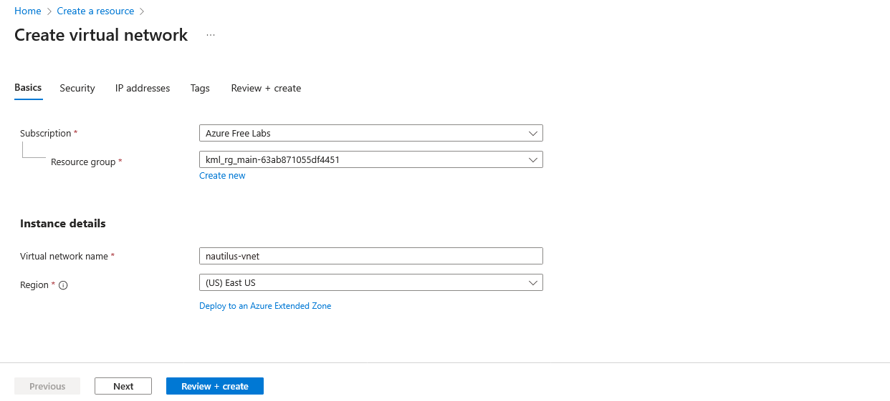
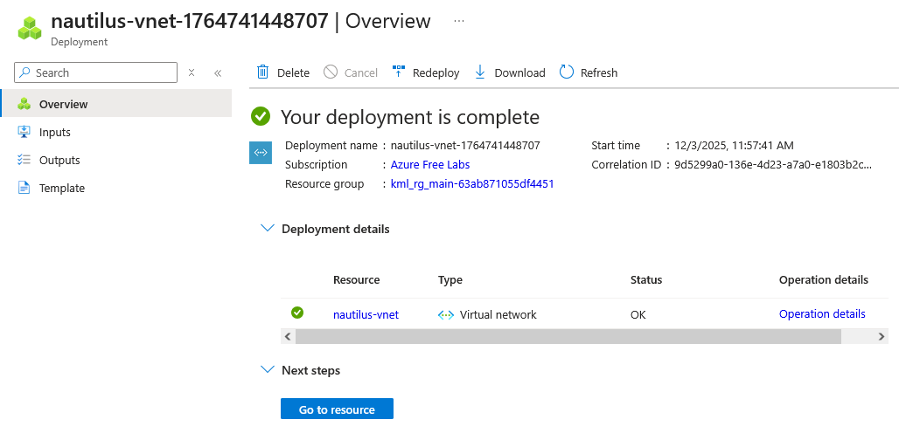

# Day 4: Create a Virtual Network (VNet) in Azure

Create a Virtual Network (VNet) named nautilus-vnet in the East US region with any IPv4 CIDR block.

## Step 1: Go to Virtual Network Dashboard, Enter VM name and choose region.

## Step 2: As there is no further requirment and VMNet can be created under any CIDR Block, Click Review + create

