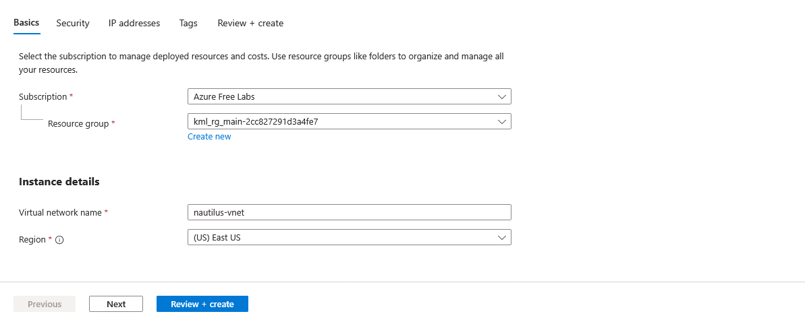
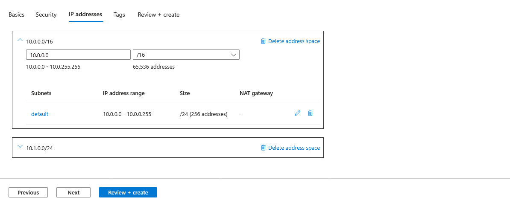
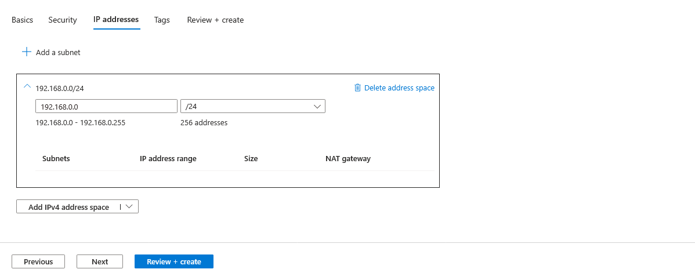
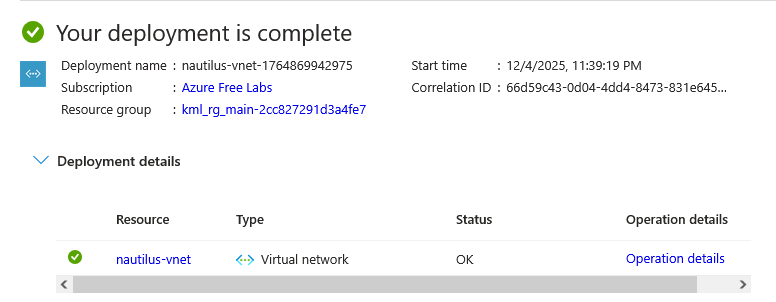

# Day 5: Create a Virtual Network (IPv4) in Azure

## Question

Create a Virtual Network (VNet) named nautilus-vnet in the East US region with 192.168.0.0/24 IPv4 CIDR.

## Step-by-Step Solution

### Step 1

In the portal, search for and select Virtual networks.

On the Virtual networks page, select + Create.

### Step 2

On the Basics tab of Create virtual network, enter, or select the following information:

### Step 3

### Step 4

Select Next to proceed to the Security tab.

Select Next to proceed to the IP Addresses tab and Delete all address spaces.

### Step 5

In Add IPv4 Address space, enter 192.168.0.0/24 Address Space for challenge requirment.

### Step 6

Select Save.

Select Review + create at the bottom of the window. When validation passes, select Create.

Verify Deployment

