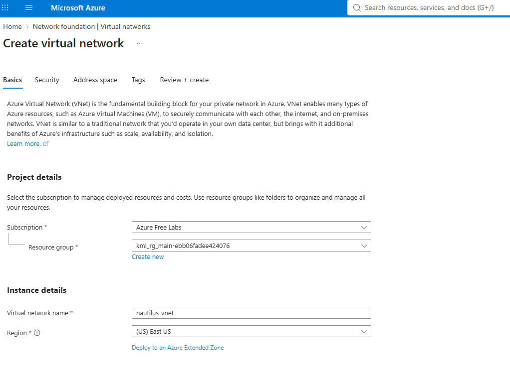
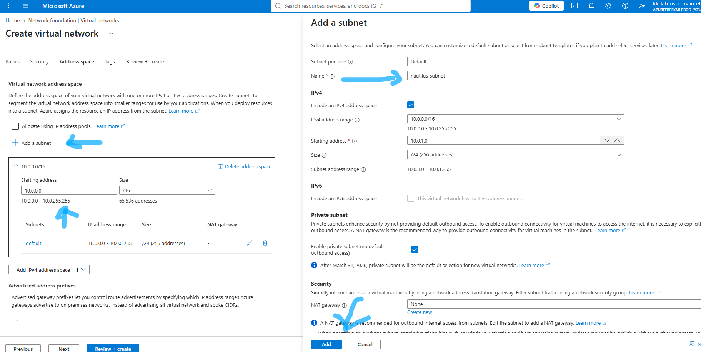

# Question

The Nautilus DevOps team is strategizing the migration of a portion of their infrastructure to the Azure cloud. Recognizing the scale of this undertaking, they have opted to approach the migration in incremental steps rather than as a single massive transition.
For this task, create a Virtual Network (VNet) named `nautilus-vnet` and one subnet named `nautilus-subnet` within the VNet in the `centralus` region. Make sure the `IPv4 address range` is `10.0.0.0/16`.

# Step-by-Step Solution

## Step 1 :Navigate to Virtual Networks:Open VNet Creation Wizard

Log in to the Azure Portal.
In the top search bar, search for Virtual networks and select it.
Click + Create (or + Add) to start creating a new Virtual Network.

## Step 2:Configure Core VNet Parameters:Basics Tab.

Fill in the following details on the **Basics** tab:

**Setting | Value / Action**
Subscription | Select your active/lab subscription.
Resource group | Select the existing resource group provided for your lab.
Name | nautilus-vnet
Region | Central US (centralus)

## Step 3: Configure Address Space & Subnet:IP Addresses Tab.

Click **Next**:
 
**IP Addresses** > (or select the IP Addresses tab at the top).
IPv4 address space: **Enter 10.0.0.0/16** (delete any default address range if pre-filled).
Under the Subnets section, click **+ Add subnet** (or edit the default subnet):

**Setting | Value / Action**
Subnet name | nautilus-subnet
Subnet address range | Set to a valid CIDR within the range, such as 10.0.0.0/24 (or 10.0.1.0/24).
Click Add or Save.

## Step 4:Deploy the VNet:Review and Create.

Click **Review + create** at the bottom of the screen.

Once validation shows **Validation passed**, click **Create**.
Wait for the deployment to finish, then click **Go to resource** to confirm.

## Verification
Once created, open nautilus-vnet in the portal and verify:
Address space shows 10.0.0.0/16.
Under Settings -> Subnets, nautilus-subnet is listed as active.