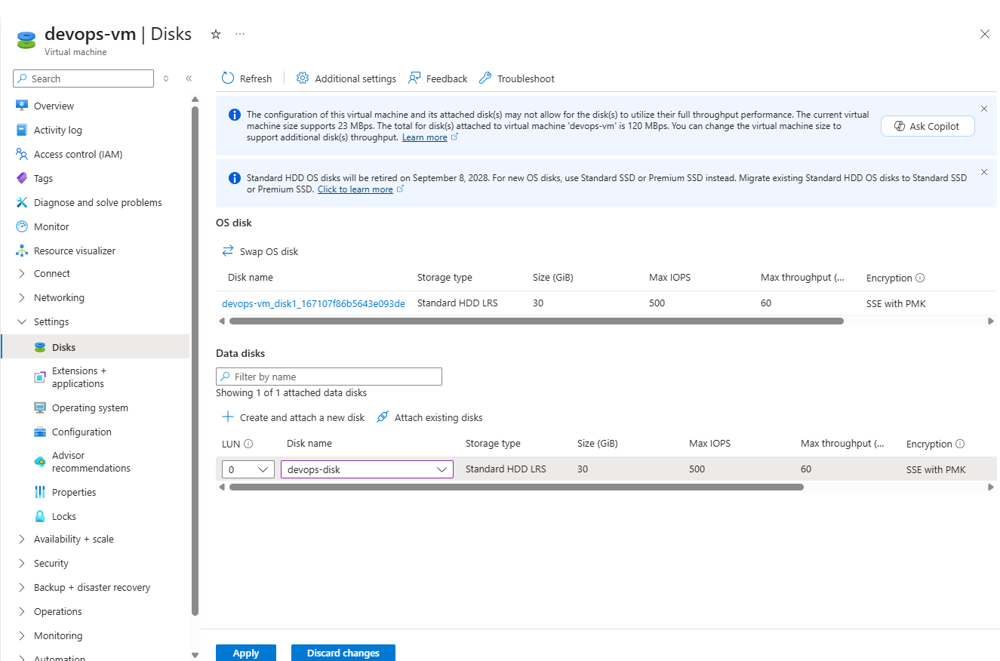

# Question

The Nautilus devops team is migrating services to Azure. They are breaking down tasks to ensure better control and optimization. You are tasked with attaching an existing data disk to a virtual machine (VM).
An existing VM named `devops-vm` and a managed disk named `devops-disk` already exist in the `centralus` region.
Attach the disk `devops-disk` to the VM `devops-vm` as a data disk.
Ensure the disk is attached to the VM `devops-vm`.
Make sure that the virtual machine initialization has been completed before submitting this task.

# Step-by-Step Solution

### Option 1: Using the Azure CLI

Find your resource group name.
```bash
az group list --output table
```

Attach the disk:
```bash
az vm disk attach \
  --resource-group <YOUR_RESOURCE_GROUP> \
  --vm-name devops-vm \
  --disk devops-disk \
  --lun 1
```

### Option 2: Using the Azure Portal

1.  **Navigate to your Virtual Machine:**
    -   Log in to the Azure Portal.
    -   Search for **Virtual machines** and select the `devops-vm`.



2.  **Attach the Data Disk:**
    -   On the left-hand menu, under **Settings**, click **Disks**.
    -   Click the **+ Create and attach a new disk** button at the top (or **+ Attach existing disks** if available).
    -   In the blade that opens:
        -   Click on **Disk name**. Select `devops-disk` from the dropdown list.
        -   For **LUN (Logical Unit Number)**, enter `1` (or the next available number).
        -   Keep all other settings (Encryption, Host caching) as default or as appropriate for your setup.
    -   Click **Save**.

### Verification

After the operation completes:
1.  Go back to the `devops-vm` overview page.
2.  Check the **Disks** section to ensure `devops-disk` is listed as a data disk.
3.  (Optional) You can SSH into the VM and run `lsblk` to verify the new disk is recognized by the operating system.